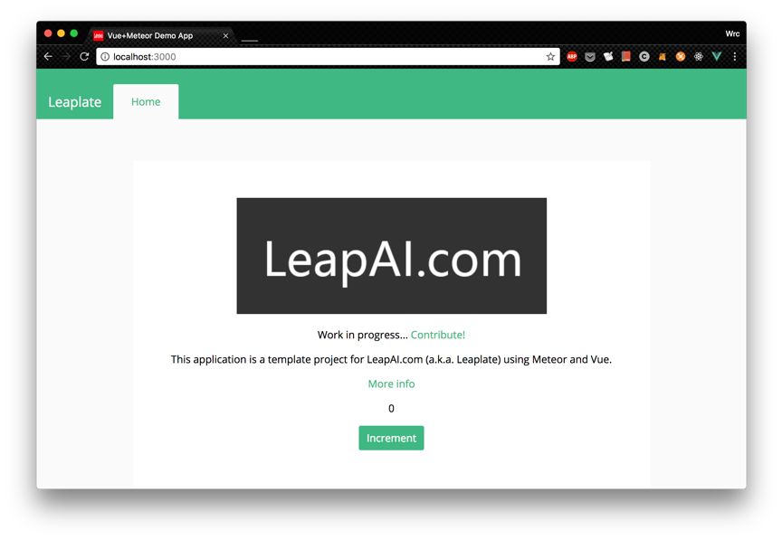

# 开发指南

## 搭建开发环境

1. LeapAI.com应用开发推荐使用Microsoft Visual Studio Code作为代码编辑器，请前往<https://code.visualstudio.com> 下载你的操作系统对应的版本。
2. LeapAI.com应用开发过程需要NodeJS环境，请前往<https://nodejs.org/> 下载你的操作系统对应的版本，下载时请选择LTS版本（目前的版本号是8.11.4）
3. LeapAI.com应用使用meteorjs框架。请访问<https://www.meteor.com> 获取meteorjs。
  a. Mac/Linux： `curl https://install.meteor.com/ | sh`
  b. Windows： 首先安装[Chocolatey](https://chocolatey.org/install), 然后用管理员命令行运行：`choco install meteor`

## 创建应用程序

1. LeapAI平台为开发者提供了应用模版（leaplate），使得快速应用开发成为可能。模版使用了meteorjs应用框架和vuejs前端框架，使开发者可以用最小代价开发出美观，高效的实时应用。
2. 访问github的leaplate项目：<https://github.com/leapai/leaplate> 
3. 将leaplate代码克隆到本地：`git clone https://github.com/leapai/leaplate.git`
4. 安装代码依赖库：`meteor npm install`
  *注意：由于meteorjs使用了自己的包管理系统，所以不能直接使用：`npm install`*
5. 运行：meteor
6. 打开浏览器（推荐使用Chrome），访问localhost：3000即可查看应用框架。
7. 在框架中添加相应代码实现业务功能。

## 重要API

1. LeapAI通过API网关、UCQ、API Broker/FlexBroker实现从云端访问用户环境的API。返回的数据由API Broker/FlexBroker直接推送到云端的实时数据库，再通过动态数据交换协议（DDP）实现与UI同步。
2. `/appusers/login`：登陆应用，获取AccessToken。用户可以通过开发者控制台管理可登陆的最终用户。
3. API需要在API商店里购买后，才能绑定到应用。API每次被调用时将被记录，对于引入的第三方API， LeapAI平台将有可能收取一定的费用。
